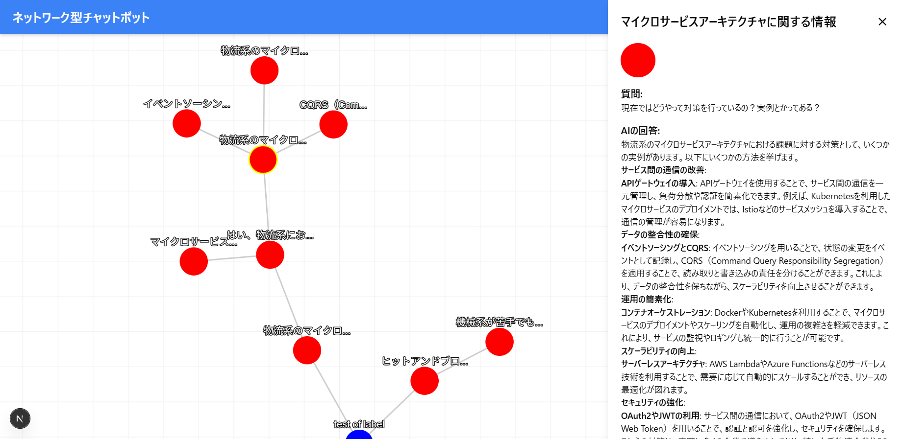

#   Graph-Based-AIChatBot

## intrduction

### 課題意識
生成AIのほとんどのインターフェースはLINEなどのコミュニケーションツールを模した物になっています。この時のデータ構造はスタックで、会話は下に積まれていく形で展開されていきます。

しかしながら、会話をもう少し抽象的に捉えると、マインドマップのように点と点が繋がり、一つの木が根を張るように展開されるのではないかと考えました。

実際、生成AIを勉強の補助に使ったりしていると、「会話の履歴を遡るのが面倒」みたいな問題を抱えることがよくあります。今回は以上のような問題意識から、グラフ構造で会話ができる生成AIを作ってみました。

---
### 提案したいこと
「会話＋回答」のセットを一つのノードに格納し、会話の時系列的な関連をエッジでつなぎます。図で表すとこんな感じ
```
Root (Q1) ──→ Q2 ──→ Q5 ──→ Q8
│             │
│             ├──→ Q6 ──→ Q9
│             │
│             └──→ Q7
│
├──→ Q3 ──→ Q10 ──→ Q12
│             │
│             └──→ Q11
│
└──→ Q4 ──→ Q13 ──→ Q15
              │
              ├──→ Q14
              │
              └──→ Q16 ──→ Q17
```
たとえば、Q9から会話を行う場合、親ノードを参照して会話の履歴を取得します。（Q9,Q6,Q2,Q1）

実際に作ったのはこんな感じ。


---
### 嬉しいこと
１．会話の枝分かれが可能なので、会話をスクロールして履歴を遡る必要がない事

２．会話が構造化されているため、余分な履歴がなく、AI側が意図を理解しやすくなる→精度の向上

３．会話の削除が可能


### 技術スタック

Language : TypeScript\
FrameWork : Next.js, TailwandCSS\
Library : Cytoscape.js, Vercel AI SDK\
Database : Supabase\
Infrastructure : Docker\
Version Control : Git,GitHub

・docker image build instaction
docker build -t nextjs-app .

・run containar
docker run -p 3000:3000 -v $(pwd):/app -v /app/node_modules --rm nextjs-app

コンテナ環境で開発する場合
１．コンテナ起動
２．F1キー　→　remote-container:Attach to runnning container
