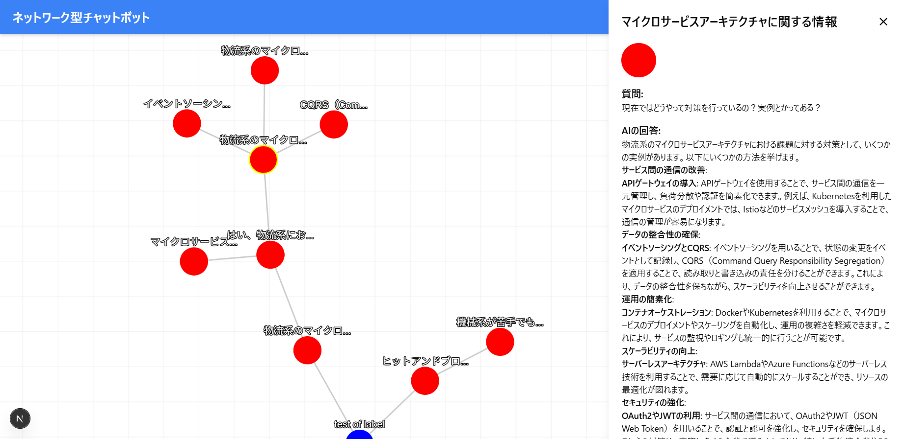

# Graph-Based AI ChatBot

### 課題意識
生成AIのほとんどのインターフェースはLINEなどのコミュニケーションツールを模したものになっています。このときのデータ構造はスタックで、会話は下に積まれていく形で展開されていきます。

しかしながら、会話をもう少し抽象的に捉えると、マインドマップのように点と点が繋がり、一つの木が根を張るように展開されるのではないかと考えました。

実際、生成AIを勉強の補助に使ったりしていると、「会話の履歴を遡るのが面倒」といった問題を抱えることがよくあります。今回は以上のような問題意識から、グラフ構造で会話ができる生成AIを作ってみました。

---

### 提案
「会話＋回答」のセットを一つのノードに格納し、会話の時系列的な関連をエッジでつなぎます。図で表すと以下のようになります。

```
Root (Q1) ──→ Q2 ──→ Q5 ──→ Q8
│             │
│             ├──→ Q6 ──→ Q9
│             │
│             └──→ Q7
│
├──→ Q3 ──→ Q10 ──→ Q12
│             │
│             └──→ Q11
│
└──→ Q4 ──→ Q13 ──→ Q15
              │
              ├──→ Q14
              │
              └──→ Q16 ──→ Q17
```

たとえば、Q9から会話を行う場合、親ノードを参照して会話の履歴を取得します。（Q9, Q6, Q2, Q1）

実際に作ったのは以下のようなものです。




)

---

### 嬉しいこと
1. 会話の枝分かれが可能なので、会話をスクロールして履歴を遡る必要がないこと。
2. 会話が構造化されているため、余分な履歴がなく、AI側が意図を理解しやすくなる → 精度の向上。

---

## 技術スタック

- **Language**: TypeScript  
- **Framework**: Next.js, TailwindCSS  
- **Library**: Cytoscape.js, Vercel AI SDK  
- **Database**: Supabase  
- **Infrastructure**: Docker  
- **Version Control**: Git, GitHub  

---

## usage（逐次更新予定）

### 必要なもの（docker想定）
- Docker（Dockerを使用する場合）
- OpenAI APIキー
- Supabaseアカウントとプロジェクト

### Supabaseのセットアップ

#### 1. Supabaseプロジェクトの作成
1. [Supabase](https://supabase.com/)にログインし、新しいプロジェクトを作成します
2. プロジェクト名を入力し、地域を選択します
3. 作成されたプロジェクトのURLとAPIキーを`.env.local`に設定します

#### 2. テーブル構造の作成
コンテナ内から以下のコマンドを実行してテーブルを作成します：

```bash
# SQLスクリプトの実行
cat ./database/schema.sql | psql $DATABASE_URL
```

または、Supabaseダッシュボードの「SQLエディタ」から以下のSQLを実行:

```sql
-- ノードテーブルの作成
CREATE TABLE public.nodes (
  id SERIAL PRIMARY KEY,
  label TEXT,
  query TEXT,
  response TEXT,
  parent INTEGER REFERENCES public.nodes(id),
  color TEXT DEFAULT 'blue',
  summary TEXT
);

-- 最初のルートノードを作成
INSERT INTO public.nodes (label, query, response, color, summary)
VALUES ('Root', 'Initial query', 'Welcome to the chat system.', 'green', 'Root node');
```


### 環境変数の設定
プロジェクトのルートディレクトリに`.env.local`ファイルを作成し、以下の環境変数を設定してください。

```
OPENAI_API_KEY=your_openai_api_key_here
NEXT_PUBLIC_SUPABASE_URL=your_supabase_url 
NEXT_PUBLIC_SUPABASE_ANON_KEY=your_supabase_anon_key
```

### Dockerを使用した開発

#### Dockerイメージのビルド
```
docker build -t nextjs-app .
```

#### コンテナの起動
```
docker run -p 3000:3000 -v $(pwd):/app -v /app/node_modules --rm nextjs-app
```

#### コンテナ環境での開発手順
1. コンテナを起動します。
2. VSCodeで`F1`キーを押し、`Remote-Container: Attach to Running Container`を選択します。
